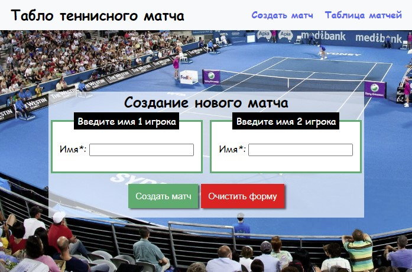

# Табло теннисного матча

Проект представляет собой веб-приложение, реализующее табло счёта теннисного матча.

Проект создан в рамках **Python Roadmap Сергея Жукова** -> [ссылка](https://zhukovsd.github.io/python-backend-learning-course/)
  

  

## Запуск проекта
1. Выполните клонирование проекта `git clone git@github.com:Wh4tisl0ve/Tennis_scoreboard.git`
2. Создайте виртуальное окружение выполнив `python3 -m venv venv`
3. Активируйте виртуальное окружение выполнив `venv\Scripts\activate` для Windows или `source myenv/bin/activate` для Linux
4. Установите необходимые зависимости выполнив `pip install requirements.txt`
5. Создайте базу данных MySQL выполнив SQL скрипт `CREATE DATABASE tennis_scoreboard`
6. Заполните необходимые поля файла .env-example и переименуйте этот файл в .env
7. Установите актуальное состояние базы данных выполнив `alembic upgrade head` 
8. Запустите скрипт выполнив `python3 run.py` в терминале.

## Структура проекта

* [run.py](run.py) Файл, позволяющий запустить wsgi приложение
* [tests](tests) Директория, содержащая тесты логики подсчета очков
* [app/mini_framework](app/mini_framework) Директория, содержащая реализацию простейшего фреймворка
* [app/repository](app/repository) Директория, содержащая слой "Репозиторий"
* [app/static](app/static) Директория, содержащая статические файлы
* [app/templates](app/templates) Директория, содержащая HTML шаблоны, используемые для рендеринга
* [app/tennis_logic](app/tennis_logic) Директория, содержащая логику подсчета очков в теннисном матче
* [app/config.py](app/config.py) Файл, содержащий конфигурацию приложения, сервера и базы данных
* [app/models.py](app/models.py) Файл, содержащий объекты, описывающие структуру данных
* [app/views.py](app/controllers.py) Файл, содержащий функции, обрабатывающие пользовательские запросы

## Реализация логики подсчета очков в теннисном матче
С целью избежания дублирования кода при реализации логики подсчета, она была реализована в ООП-стиле.

## Описание страниц проекта
### Страница нового матча 
Адрес - `/`.
Представляет собой форму для создания нового матча. 
Содержит два поля для ввода имен игроков и кнопку для отправления POST запроса.  
Результатом нажатия кнопки будет редирект на страницу `/match-score?uuid=$match_id`

### Страница счёта матча
Адрес - `/match-score?uuid=$match_id`. GET параметр uuid содержит UUID матча.  
Представляет собой таблицу для ведения счета матча.  
Нажатие кнопок приводит к POST запросу по адресу `/match-score?uuid=$match_id`, в полях отправленной формы содержится выигравший очко игрок

Теннисный матч играется по системе BOF3.  
При достижении 2 очков в Match, игра считается завершенной. Определяется победитель и результат выводится на страницу.

### Страница сыгранных матчей
Адрес - `/matches?page=$page_number&filter_by_player_name=$player_name&per_page=$per_page`. GET параметры:
* `page` - номер страницы. Если параметр не задан, подразумевается первая страница  
* `filter_by_player_name` - имя игрока, матчи которого ищем. Если параметр не задан, отображаются все матчи
* `per_page` - количество записей на страницу. Если параметр не задан, отображается 10 записей.

Постранично отображает список сыгранных матчей. 
Нажатие кнопки "применить" приводит к формированию GET запрос вида `/matches?filter_by_player_name=${NAME}&per_page=${per_page}`.  
Позволяет искать матчи игрока по его имени. 
Для переключения страниц реализована пагинация.

## База данных(структура)
В качестве системы управления базами данных была выбрана MySQL. 
Для управления объектами бд была использована ORM SqlAlchemy.
База данных содержит в себе 3 таблицы:
1. `Players` - таблица, содержащая информацию об игроках.
2. `Matches` - таблица, содержащая информацию о теннисном матче.
3. `Match story` - таблица, содержащая информацию о забитых голах в теннисном матче.

## Тесты
В качестве фреймворка для тестирования был выбран [pytest](https://docs.pytest.org/en/stable/index.html).
Юнит тестами была покрыта логика подсчета очков в теннисном матче. Основные тест-кейсы:
* Проверка корректности начисления очков для игроков
* Проверка работы механизма преимущества(AD) игроков
* Проверка работы механизма потери преимущества
* Проверка работы механизма сброса очков после взятия очка при преимуществе(AD)
* Проверка корректности начисления победы в сете для игроков
* Проверка работы механики начисления очков после объявления тай-брейка
* Проверка победы в матче

## Стек 

* Python 3.12
* pytest
* Waitress
* jinja2
* MySQL
* SqlAlchemy
* html-css-js
